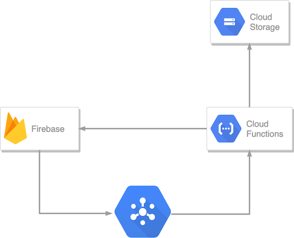

# Steamosaic: Generate a mosaic of your steam account

## Why firebase?

The very first version was using a Google Cloud Function that takes a user as input and generates the mosaic, then returns the image. On the frontend side, I used `XMLHttpRequest` to request the mosaic and that's it.

But as you can see many issues can occur, like timeouts, cache misses, waste of resources, etc.

So instead of pulling out an over-engineered task queue or something like that, I changed the cloud function to subscribe to a pubsub topic and on the frontend side creates or start to listen to the firestore document that holds the needed.

On the firebase side, whenever a document is created, a function publishes on the topic that another _worker function_ is listening. 

When the _worker function_ finishes, it writes back to the document the public URL of the mosaic image triggering the frontend to display it.

If you want to take a look more deeply, these are the main files [main.py], [index.js] and [app.js].

[main.py]: https://github.com/skhaz/steamosaic/blob/master/functions/main.py
[index.js]: https://github.com/skhaz/steamosaic/blob/master/firebase/functions/index.js
[app.js]: https://github.com/skhaz/steamosaic/blob/master/firebase/public/js/app.js
